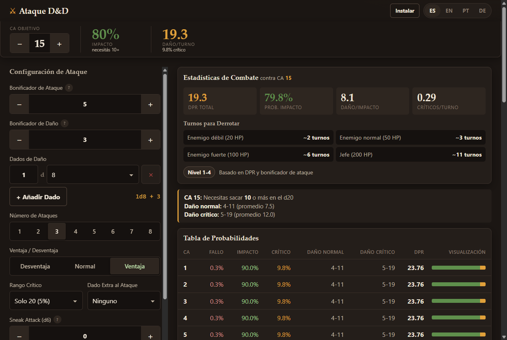
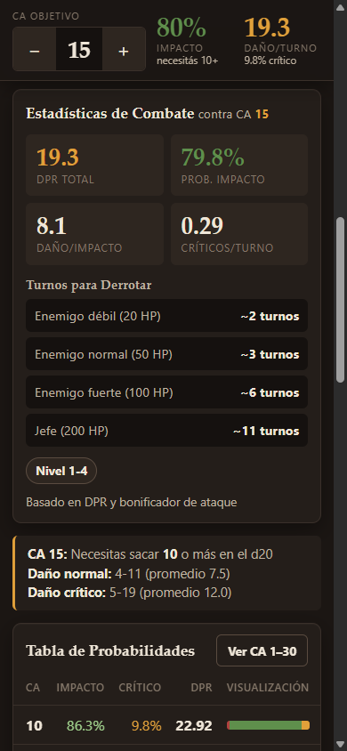
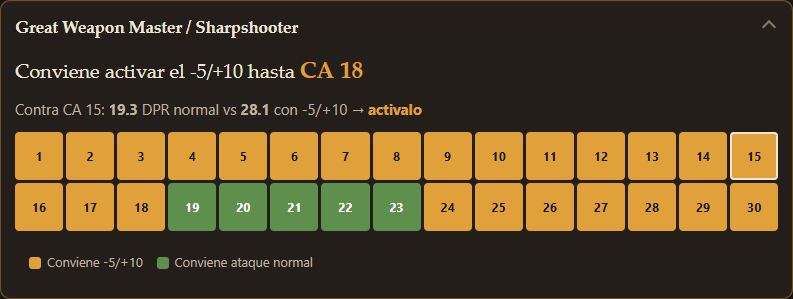
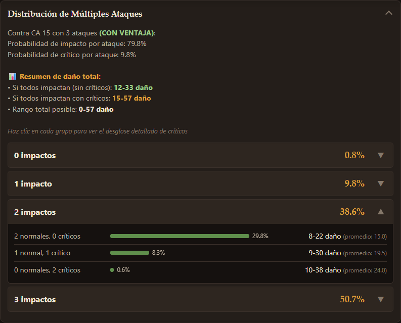

# ⚔️ Calculadora de Probabilidades de Ataque D&D

🌐 **[Ver calculadora online](https://francomal.github.io/dnd-attack-probability/)**

## 🇪🇸 Español

### ¿Qué es esto?

Una calculadora de probabilidades de combate para Dungeons & Dragons 5e. Calcula las probabilidades exactas de impactar, hacer crítico y el daño esperado contra cualquier enemigo.

<details>
<summary>📸 Ver captura de pantalla (click para expandir)</summary>







</details>

### Características principales

- **Tabla completa de probabilidades**: Ve tus probabilidades de impacto contra CAs del 1 al 30
- **Ventaja/Desventaja**: Cálculos precisos con mecánica de 2d20
- **Rango crítico configurable**: 20, 19-20 o 18-20
- **Múltiples dados**: Soporta combinaciones complejas (2d6+1d4+3, etc.)
- **Sneak Attack**: Dados d6 que se aplican **una sola vez por turno** y se **duplican en crítico** (regla oficial de D&D 5e). No se multiplican por el número de ataques
- **Múltiples ataques**: Calcula probabilidades de hacer 0, 1, 2... n impactos
- **Distribución de críticos**: Ve cuántos de tus impactos serán críticos
- **Rangos de daño**: Muestra daño mínimo-máximo para cada escenario
- **Great Weapon Master / Sharpshooter**: te dice hasta qué CA conviene el -5/+10, y qué hacer contra la CA objetivo
- **Estilo de Combate: Arma Grande (GWF)**: relanza los 1 y 2 de los dados del arma (un d8 pasa de 4.5 a 5.25 de promedio)
- **Resistencia y vulnerabilidad**: dividí o duplicá el daño contra el objetivo que tenés enfrente
- **¿Lo mato este turno?**: probabilidad exacta de bajar a un enemigo con X PV, no sólo el daño promedio
- **Curva de DPR contra el rango de CA**: compará builds sobre CA 10–25 y mirá dónde una pasa a la otra
- **Recálculo en vivo**: todo se actualiza al instante al cambiar cualquier valor
- **Pensada para el celular**: barra pegajosa con la CA objetivo, % de impacto y daño por turno siempre a la vista; controles grandes para usarla con una mano en la mesa
- **Instalable y offline (PWA)**: agregala a la pantalla de inicio y funciona sin internet
- **Perfiles**: guardá builds, comparalas contra una CA y exportalas/importalas como JSON (backup y compartir con la mesa)

### Cómo usar

1. Abrí la [versión online](https://francomal.github.io/dnd-attack-probability/) o `calculator-standalone.html`
2. Ajustá la **CA objetivo** con − / + en la barra superior
3. Configurá tu personaje: bonificador de ataque, dados y bono de daño, nº de ataques, ventaja/desventaja, rango crítico, dado extra (Bendición), Sneak Attack
4. Los resultados se recalculan solos: la barra superior muestra impacto y daño por turno; más abajo, estadísticas, tabla y distribución de multiataque

**Instalar en el celular**: en Android/Chrome tocá el botón "Instalar" que aparece arriba (o menú → *Agregar a pantalla de inicio*). En iOS/Safari: Compartir → *Agregar a inicio*. Después funciona sin conexión.

### Archivos

- **`index.html`** + **`styles.css`** + **`engine.js`** + **`profiles-io.js`** + **`calculator.js`**: la app
  - `engine.js`: toda la matemática (funciones puras, sin DOM). Única fuente de verdad
  - `profiles-io.js`: exportar/importar perfiles en JSON, con validación (también puro)
  - `calculator.js`: interfaz, perfiles, comparador, i18n
- **`manifest.webmanifest`**, **`sw.js`**, **`icons/`**: PWA (instalación y caché offline)
- **`calculator-standalone.html`**: todo en un solo archivo, **generado** desde los fuentes (no editar a mano)
- **`tests/`**: tests del motor y del daño (cada uno contra su oráculo de fuerza bruta), del import/export y de las traducciones

### Desarrollo

Sin dependencias: sólo hace falta Node ≥ 20.

```bash
npm test                  # tests del motor (node --test)
npm run build:standalone  # regenera calculator-standalone.html
npm run build:icons       # regenera icons/*.png
```

Al publicar una versión nueva subí `CACHE_VERSION` en `sw.js` para que los usuarios instalados reciban la actualización. Durante el desarrollo, el service worker sirve desde caché: si no ves tus cambios, desregistralo en DevTools → Application → Service Workers.

#### Formato de perfiles (`profiles-io.js`)

El archivo exportado es `{ format, version, exportedAt, profiles }`. Al importar:

- Se **rechaza** el perfil al que le falta `name`, `config`, `config.attackBonus` o `config.damageDice` (no se puede inventar sin mentir); el resto del archivo se importa igual y se avisa cuántos quedaron afuera.
- Se **completan** `id` y `createdAt` si faltan (son registro, no datos del usuario).
- Se **acotan** los valores bien tipados pero fuera de rango (+999 al ataque pasa a +40) y se descartan los campos desconocidos.
- Nunca se pisa un perfil guardado: si un id se repite, el importado recibe uno nuevo.

### Matemáticas

Utiliza distribución multinomial para cálculos precisos:
- **Ventaja**: P(max ≥ x) = 1 - ((x-1)/20)²
- **Desventaja**: P(min ≥ x) = ((21-x)/20)²
- **Múltiples ataques**: P(f,n,c) = (n!/(f!×n!×c!)) × p_fallo^f × p_normal^n × p_crítico^c
- **Dado extra al ataque** (Bendición, Inspiración): enumeración exacta de todas las combinaciones de dados
- **Invariantes de 5e**: el 1 natural siempre falla; el crítico siempre impacta (aunque necesites más de lo que muestra el rango crítico)
- **GWM / Sharpshooter**: DPR por turno con y sin -5/+10 para cada CA; la "CA de corte" es la mayor CA hasta la que conviene de forma contigua desde CA 1
- **GWF**: las caras 1 y 2 pasan a valer el promedio del dado; el mínimo no cambia (el relanzamiento puede volver a salir 1) y no se aplica al Sneak Attack, que no es un dado del arma
- **Resistencia / vulnerabilidad**: multiplicador ×0.5 o ×2. Los promedios se multiplican sin redondear; los valores que son una tirada concreta (mínimos, máximos y la distribución exacta) redondean hacia abajo como en 5e
- **Probabilidad de matar**: distribución exacta del daño del turno por convolución de los dados, recorriendo los ataques con tres estados (sin impactos / con impacto / con crítico) para resolver el Sneak Attack, que depende del turno entero. Después se acumula P(daño ≥ PV)
- **Curva de DPR**: DPR por turno para cada CA del rango, y los cruces son las CAs donde cambia quién va ganando
- **Power Level**: round(DPR_por_turno promediado sobre CA 13–20 × 10)
  - No multiplica por la probabilidad de impacto: el DPR ya la incorpora, y volver a
    multiplicarla penalizaba dos veces a las builds imprecisas
  - Se promedia sobre un rango de CAs en vez de usar la CA objetivo, para que el número
    sirva para comparar builds aunque cada una tenga otro enemigo en pantalla
- **Nivel estimado**: se traduce a nivel el bonificador de ataque y el DPR por separado
  (interpolando sus tablas) y se promedian. Antes se devolvía el primer tramo que coincidía
  con cualquiera de las dos señales, así que un +2 al ataque con 36 de DPR caía en "nivel 1-4"

---

## 🇺🇸 English

### What is this?

A combat probability calculator for Dungeons & Dragons 5e. It calculates exact probabilities of hitting, critical strikes, and expected damage against any enemy.

<details>
<summary>📸 View screenshot (click to expand)</summary>


</details>

### Main Features

- **Complete probability table**: See your hit chances against AC 1 to 30
- **Advantage/Disadvantage**: Precise calculations with 2d20 mechanics
- **Configurable critical range**: 20, 19-20, or 18-20
- **Multiple dice**: Supports complex combinations (2d6+1d4+3, etc.)
- **Sneak Attack**: d6 dice applied **once per turn** and **doubled on a critical hit** (official D&D 5e rule). Not multiplied by the number of attacks
- **Multiple attacks**: Calculate probabilities of landing 0, 1, 2... n hits
- **Critical distribution**: See how many of your hits will be critical
- **Damage ranges**: Shows minimum-maximum damage for each scenario
- **Great Weapon Master / Sharpshooter**: tells you up to which AC the -5/+10 is worth it, and what to do against your target AC
- **Great Weapon Fighting**: rerolls 1s and 2s on the weapon damage dice (a d8 goes from 4.5 to 5.25 average)
- **Resistance and vulnerability**: halve or double the damage against the target in front of you
- **Can I kill it this turn?**: exact probability of dropping an enemy with X HP, not just average damage
- **DPR curve across the AC range**: compare builds over AC 10–25 and see where one overtakes the other
- **Live recalculation**: everything updates instantly as you change any value
- **Built for phones**: sticky bar with target AC, hit chance and damage per turn always visible; large one-handed controls for use at the table
- **Installable and offline (PWA)**: add it to your home screen and it works with no internet
- **Profiles**: save builds, compare them against an AC, and export/import them as JSON (backup and sharing with your table)

### How to Use

1. Open the [online version](https://francomal.github.io/dnd-attack-probability/) or `calculator-standalone.html`
2. Set the **target AC** with − / + in the top bar
3. Configure your character: attack bonus, damage dice and bonus, number of attacks, advantage/disadvantage, crit range, extra attack die (Bless), Sneak Attack
4. Results recalculate on their own: the top bar shows hit chance and damage per turn; below it, combat stats, the table and the multi-attack distribution

**Install on your phone**: on Android/Chrome tap the "Install" button at the top (or menu → *Add to Home screen*). On iOS/Safari: Share → *Add to Home Screen*. It then works offline.

### Files

- **`index.html`** + **`styles.css`** + **`engine.js`** + **`profiles-io.js`** + **`calculator.js`**: the app
  - `engine.js`: all the math (pure functions, no DOM). Single source of truth
  - `profiles-io.js`: JSON profile export/import with validation (also pure)
  - `calculator.js`: UI, profiles, comparison, i18n
- **`manifest.webmanifest`**, **`sw.js`**, **`icons/`**: PWA (install and offline cache)
- **`calculator-standalone.html`**: everything in one file, **generated** from the sources (do not edit by hand)
- **`tests/`**: engine tests (against a brute-force oracle) and import/export tests

### Development

No dependencies: only Node ≥ 20.

```bash
npm test                  # engine tests (node --test)
npm run build:standalone  # regenerates calculator-standalone.html
npm run build:icons       # regenerates icons/*.png
```

When shipping a new version bump `CACHE_VERSION` in `sw.js` so installed users get the update. While developing, the service worker serves from cache: if you don't see your changes, unregister it in DevTools → Application → Service Workers.

#### Profile format (`profiles-io.js`)

The exported file is `{ format, version, exportedAt, profiles }`. On import:

- A profile missing `name`, `config`, `config.attackBonus` or `config.damageDice` is **rejected** (those can't be guessed without lying); the rest of the file is still imported and you're told how many were skipped.
- `id` and `createdAt` are **filled in** when missing (bookkeeping, not user data).
- Well-typed but out-of-range values are **clamped** (+999 to hit becomes +40) and unknown fields are dropped.
- A saved profile is never overwritten: on an id collision the imported one gets a fresh id.

### Mathematics

Uses multinomial distribution for precise calculations:
- **Advantage**: P(max ≥ x) = 1 - ((x-1)/20)²
- **Disadvantage**: P(min ≥ x) = ((21-x)/20)²
- **Multiple attacks**: P(f,n,c) = (n!/(f!×n!×c!)) × p_miss^f × p_normal^n × p_crit^c
- **Extra attack die** (Bless, Bardic Inspiration): exact enumeration of every dice combination
- **5e invariants**: a natural 1 always misses; a crit always hits (even when the roll you need is above the crit range)
- **GWM / Sharpshooter**: DPR per turn with and without -5/+10 for every AC; the "cutoff AC" is the highest AC up to which it is worth it contiguously from AC 1
- **Power Level**: round(per-turn DPR averaged over AC 13–20 × 10)
  - It does not multiply by hit probability: DPR already includes it, and multiplying again
    penalised imprecise builds twice
  - Averaged over a range of ACs instead of the target AC, so the number can compare builds
    even when each one has a different enemy on screen
- **Estimated level**: attack bonus and DPR are each translated to a level (by interpolating
  their tables) and averaged. Previously the first tier matching *either* signal was returned,
  so a +2 to hit with 36 DPR landed in "level 1-4"

---

## 🎲 Example

**Character setup:**
- Attack bonus: +5
- Damage: 1d8 + 3
- Advantage: Yes
- Attacks: 3

**Against AC 15:**
- Hit chance per attack: 79.8%
- Critical chance per attack: 9.8%
- Expected damage: 19.3 per round
- 50.6% chance to hit all 3 attacks

**Click on distribution groups to see detailed critical breakdowns!**

### 📸 Screenshots / Capturas de Pantalla

<details>
<summary><strong>Ver distribución de múltiples ataques / View multiple attacks distribution</strong></summary>



**🇪🇸 Español:**
*La imagen muestra el desglose completo de probabilidades para múltiples ataques, incluyendo todas las combinaciones posibles de impactos normales y críticos, con rangos de daño exactos.*

**🇺🇸 English:**
*The image shows the complete probability breakdown for multiple attacks, including all possible combinations of normal and critical hits, with exact damage ranges.*

</details>

---

Made with D&D 5e rules
